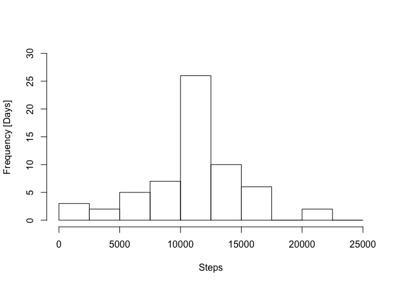

# Reproducible Research: Peer Assessment 1

##Loading and preprocessing the data
- No extra packages loaded, just packages loaded in Rstudio as default used

- Set working directory

```r
setwd("/Users/hss1g09/DataScience/ReproducibleResearch")
```
- Make new folder

```r
if (!file.exists("Assign1")){
        dir.create("Assign1")
}
```
- Set working directory to new folder

```r
setwd("/Users/hss1g09/DataScience/ReproducibleResearch/Assign1")
```
- define URL of data

```r
fileURL<-"https://d396qusza40orc.cloudfront.net/repdata%2Fdata%2Factivity.zip"
```
- download

```r
download.file(fileURL, destfile="/Users/hss1g09/DataScience/ReproducibleResearch/Assign1/repdata_2Fdata_2Factivity.zip", method="curl")
```
- time stamp

```r
dateDownload<-date()  #records when downloaded
dateDownload
```

```
## [1] "Sat Jan 17 23:51:32 2015"
```
- unzip and read data into a table: 'tab'

```r
data<-unzip("/Users/hss1g09/DataScience/ReproducibleResearch/Assign1/repdata_2Fdata_2Factivity.zip")
tab<-read.csv(data)
```

##How does the data look like? (not in assignment)

```r
head(tab)
```

```
##   steps       date interval
## 1    NA 2012-10-01        0
## 2    NA 2012-10-01        5
## 3    NA 2012-10-01       10
## 4    NA 2012-10-01       15
## 5    NA 2012-10-01       20
## 6    NA 2012-10-01       25
```

```r
tail(tab)
```

```
##       steps       date interval
## 17563    NA 2012-11-30     2330
## 17564    NA 2012-11-30     2335
## 17565    NA 2012-11-30     2340
## 17566    NA 2012-11-30     2345
## 17567    NA 2012-11-30     2350
## 17568    NA 2012-11-30     2355
```

```r
str(tab)
```

```
## 'data.frame':	17568 obs. of  3 variables:
##  $ steps   : int  NA NA NA NA NA NA NA NA NA NA ...
##  $ date    : Factor w/ 61 levels "2012-10-01","2012-10-02",..: 1 1 1 1 1 1 1 1 1 1 ...
##  $ interval: int  0 5 10 15 20 25 30 35 40 45 ...
```

```r
summary(tab)
```

```
##      steps                date          interval     
##  Min.   :  0.00   2012-10-01:  288   Min.   :   0.0  
##  1st Qu.:  0.00   2012-10-02:  288   1st Qu.: 588.8  
##  Median :  0.00   2012-10-03:  288   Median :1177.5  
##  Mean   : 37.38   2012-10-04:  288   Mean   :1177.5  
##  3rd Qu.: 12.00   2012-10-05:  288   3rd Qu.:1766.2  
##  Max.   :806.00   2012-10-06:  288   Max.   :2355.0  
##  NA's   :2304     (Other)   :15840
```

##Part 1: What is mean total number of steps taken per day?
###1 - Histogram
- calculate the steps taken each day

```r
sum_steps<-tapply(tab$steps,tab$date,sum) 
```
- make the histogram of the total number of steps taken each day

```r
hist(sum_steps, breaks=seq(0,25000,2500), xlim=c(0,25000),ylim=c(0,20), xlab=c("Steps"),
     ylab=c("Frequency [Days]"), main=c(), plot=TRUE)
```

 

###2 - Mean and median 
- both the mean and median can be displayed with summary()

```r
summary(sum_steps)
```

```
##    Min. 1st Qu.  Median    Mean 3rd Qu.    Max.    NA's 
##      41    8841   10760   10770   13290   21190       8
```

##Part 2: What is the average daily activity pattern?
###1 - Time series plot
- calculate the mean of each 5-minute interval over all days
- NA are ignored with na.rm=TRUE

```r
mean_steps_interval<-tapply(tab$steps,tab$interval,mean, na.rm=TRUE)
```
- to plot the data the mean_steps_interval are converted into a data frame: mean_int
- the data are then plotted using the basic plotting system

```r
mean_int<-data.frame(mean_steps_interval)
mean_int$interval<-unique(tab$interval)

head(mean_int) #quick look at the new table
```

```
##    mean_steps_interval interval
## 0            1.7169811        0
## 5            0.3396226        5
## 10           0.1320755       10
## 15           0.1509434       15
## 20           0.0754717       20
## 25           2.0943396       25
```

```r
par(mfrow=c(1,1))
plot(mean_int$mean_steps_interval~mean_int$interval,type="l", xaxt="n", 
     xlab=c("Time of day [h]"), ylab=c("Number of steps"))
axis(1, at=c(0, 400, 800, 1200, 1600, 2000,2355),labels=c("00:00","4:00","8:00","12:00",
                                                    "16:00","20:00","23:55"))
```

 

###2 - max steps in 5 min interval
- calculate the interval with the most steps taken over all days

```r
max_int<-mean_int[which(mean_int$mean_steps_interval== max(mean_int$mean_steps_interval)),]
max_int$interval
```

```
## [1] 835
```

##Part 3:Imputing missing values
###1 - Total number of NA
- calculate the total number of NA for each column: steps, date, interval

```r
steps_NA<-is.na(tab$steps)
sum(steps_NA)
```

```
## [1] 2304
```

```r
date_NA<-is.na(tab$date)
sum(date_NA)
```

```
## [1] 0
```

```r
interval_NA<-is.na(tab$interval)
sum(interval_NA)
```

```
## [1] 0
```

###2 - Fill NA with mean of 5 min interval
- each NA is replaced with the mean value of the interval over all days and saved as table: new_tab
- within the for loop the column date is convertic to numeric, thus the a column new_date is inserted to the table new_tab after the for loop


```r
#tab$new_interval<-tab$interval+1
new_tab<-matrix(data=NA,ncol=dim(tab)[2],nrow=dim(tab)[1])
colnames(new_tab)<-names(tab)
counter<-1
int<-seq(0,2355,5)
for (i in int){
        
        Loop_interval<-tab[which(tab$interval==i),]
        mean_steps<-mean(Loop_interval$steps,na.rm=TRUE)
        
        
        for (d in Loop_interval$date){
                
                Loop_date<-Loop_interval[which(Loop_interval$date==d),]
                
                if(is.na(Loop_date$steps)==TRUE) 
                        {new_tab[counter, 1]<-mean_steps
                }else{
                        new_tab[counter,1]<-Loop_date$steps}
                       
              
                new_tab[counter,2]<-Loop_date$date
                new_tab[counter,3]<-i
               
                
                counter<-counter +1   
        }
       
}
```

- convert matrix to data.frame

```r
new_tab_df<-data.frame(new_tab)
```
- differently sorted version of the original table in oder of the intervals to match new_tab order

```r
tab_interval_sorted<-tab[order(tab$interval),]
```

###3 - New data table
- the final new data table contains the extra column new_date 

```r
new_tab_df$new_date<-tab_interval_sorted$date

new_tab_df<-new_tab_df[order(new_tab_df$new_date),]
```
comparison tab and new_tab

```r
tab[1:20,]
```

```
##    steps       date interval
## 1     NA 2012-10-01        0
## 2     NA 2012-10-01        5
## 3     NA 2012-10-01       10
## 4     NA 2012-10-01       15
## 5     NA 2012-10-01       20
## 6     NA 2012-10-01       25
## 7     NA 2012-10-01       30
## 8     NA 2012-10-01       35
## 9     NA 2012-10-01       40
## 10    NA 2012-10-01       45
## 11    NA 2012-10-01       50
## 12    NA 2012-10-01       55
## 13    NA 2012-10-01      100
## 14    NA 2012-10-01      105
## 15    NA 2012-10-01      110
## 16    NA 2012-10-01      115
## 17    NA 2012-10-01      120
## 18    NA 2012-10-01      125
## 19    NA 2012-10-01      130
## 20    NA 2012-10-01      135
```

```r
new_tab_df[1:20,]
```

```
##          steps date interval   new_date
## 1    1.7169811    1        0 2012-10-01
## 62   0.3396226    1        5 2012-10-01
## 123  0.1320755    1       10 2012-10-01
## 184  0.1509434    1       15 2012-10-01
## 245  0.0754717    1       20 2012-10-01
## 306  2.0943396    1       25 2012-10-01
## 367  0.5283019    1       30 2012-10-01
## 428  0.8679245    1       35 2012-10-01
## 489  0.0000000    1       40 2012-10-01
## 550  1.4716981    1       45 2012-10-01
## 611  0.3018868    1       50 2012-10-01
## 672  0.1320755    1       55 2012-10-01
## 733  0.3207547    1      100 2012-10-01
## 794  0.6792453    1      105 2012-10-01
## 855  0.1509434    1      110 2012-10-01
## 916  0.3396226    1      115 2012-10-01
## 977  0.0000000    1      120 2012-10-01
## 1038 1.1132075    1      125 2012-10-01
## 1099 1.8301887    1      130 2012-10-01
## 1160 0.1698113    1      135 2012-10-01
```

###4 - Histogram
- calculate the steps taken each day when NA filled in

```r
sum_steps_filledNA<-tapply(new_tab_df$steps,new_tab_df$new_date,sum) 
```
- make histogramm and display mean and median with summary()

```r
hist(sum_steps_filledNA,breaks=seq(0,25000,2500), xlim=c(0,25000),ylim=c(0,30), xlab=c("Steps"),
     ylab=c("Frequency [Days]"), main=c(), plot=TRUE)
```

 

```r
summary(sum_steps_filledNA)
```

```
##    Min. 1st Qu.  Median    Mean 3rd Qu.    Max. 
##      41    9819   10770   10770   12810   21190
```

##Part 3: Are there differences in activity patterns between weekdays and weekends?
- add a new column "weekday" to new_tab (with replaced NA) with the corresponding weekday to each date
- split tab into weekend end: weekday == Saturday or Sunday and week != Saturday or Sunday
- add a new comlum "day_type" to each new table
- merge tables together again, to have a table with both week and weekend data, but use split tabes for calcuating means and to make the panel plot using the basic plotting system

```r
head(new_tab_df)
```

```
##         steps date interval   new_date
## 1   1.7169811    1        0 2012-10-01
## 62  0.3396226    1        5 2012-10-01
## 123 0.1320755    1       10 2012-10-01
## 184 0.1509434    1       15 2012-10-01
## 245 0.0754717    1       20 2012-10-01
## 306 2.0943396    1       25 2012-10-01
```

```r
str(new_tab_df)
```

```
## 'data.frame':	17568 obs. of  4 variables:
##  $ steps   : num  1.717 0.3396 0.1321 0.1509 0.0755 ...
##  $ date    : num  1 1 1 1 1 1 1 1 1 1 ...
##  $ interval: num  0 5 10 15 20 25 30 35 40 45 ...
##  $ new_date: Factor w/ 61 levels "2012-10-01","2012-10-02",..: 1 1 1 1 1 1 1 1 1 1 ...
```

```r
new_tab_df$new_date<-as.Date(new_tab_df$new_date)
new_tab_df$weekday<-weekdays(new_tab_df$new_date)

weekend<-new_tab_df[new_tab_df[,"weekday"]=="Saturday"|new_tab_df[,"weekday"]=="Sunday",]
weekend$day_type<-"weekend"

week<-new_tab_df[new_tab_df[,"weekday"]!="Saturday"|new_tab_df[,"weekday"]!="Sunday",]
week$day_type<-"weekday"

new_with_daytype<-rbind(weekend,week)

mean_steps_week<-tapply(week$steps,week$interval,mean)
mean_steps_week_df<-data.frame(mean_steps_week)
mean_steps_week_df$interval<-unique(week$interval)

mean_steps_weekend<-tapply(weekend$steps,weekend$interval,mean)
mean_steps_weekend_df<-data.frame(mean_steps_weekend)

mean_steps_weekend_df$interval<-unique(weekend$interval)

par(mfrow=c(2,1), oma=c(1,1,1,1))
plot(mean_steps_week~interval, data=mean_steps_week_df, type="l",  xaxt="n",
     ylim=c(0,200), main=c("Weekdays"),xlab=c("Time of day [h]"),ylab=c("Number of steps"))
axis(1, at=c(0, 400, 800, 1200, 1600, 2000,2355),labels=c("00:00","4:00","8:00",
                                                          "12:00","16:00","20:00",
                                                          "23:55"))

plot(mean_steps_weekend~interval, data=mean_steps_weekend_df, type="l", xaxt="n",
     ylim=c(0,200), main=c("Weekends"),xlab=c("Time of day [h]"),
     ylab=c("Number of steps"))
axis(1, at=c(0, 400, 800, 1200, 1600, 2000,2355),labels=c("00:00","4:00","8:00",
                                                          "12:00","16:00","20:00",
                                                          "23:55"))
```

 

